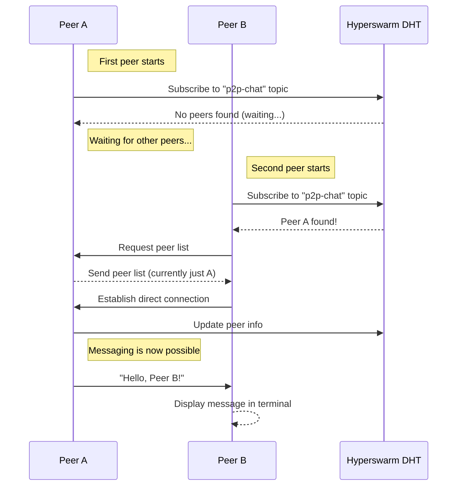

## 1. Peer Connection & Discovery

1. A peer joins the Hyperswarm network by subscribing to a common topic (`"p2p-chat"`).
2. The peer discovers existing peers and establishes direct socket connections.
3. When a peer connects, it:

   - Requests the full peer list from a single randomly chosen peer.
   - Adds those peers to its local list and connects to them.
   - Broadcasts its own ID to all connected peers

4. When a peer disconnects, it:

   - Sends a disconnect signal to all peers before leaving.
   - Peers remove the disconnected peer from their local list.
   - If a peer disconnects unexpectedly, it will be detected when another peer fails to send a message to it.

## 2. Message Exchange Flow

### Public Message (Broadcast)

1. A peer sends a message to all connected peers.
2. Each peer receives the message and displays it in the terminal.

### Direct Message (Private Chat)

1. A peer selects a specific recipient from the stored peer list.
2. The message is sent only to the selected peer’s socket.
3. The recipient receives and displays the private message.

## Diagram

